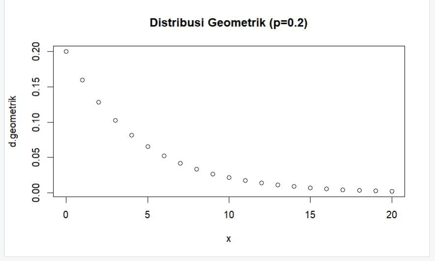

# PRAKTIKUM MODUL 1 PROBSTAT 2022

## Soal 1
Seorang penyurvei secara acak memilih orang-orang di jalan sampai dia bertemu dengan
seseorang yang menghadiri acara vaksinasi sebelumnya.

a. Berapa peluang penyurvei bertemu x = 3 orang yang tidak menghadiri acara vaksinasi
sebelum keberhasilan pertama ketika p = 0,20 dari populasi menghadiri acara vaksinasi ?
(distribusi Geometrik)
```R
dgeom(3, prob = 0.2)
```
hasil : `0.1024`

b. mean Distribusi Geometrik dengan 10000 data random , prob = 0,20 dimana distribusi
geometrik acak tersebut X = 3 ( distribusi geometrik acak () == 3 )
```R
p = 0.2
n = 3
mean(rgeom(10000, prob = p) == n)
```
menggunakan `rgeom` untuk mengenerate 10000 data, kemudian dengan `mean` mencari rata-rata nilai pada hasil generate tadi yang sama dengan (==) 3, hasil : `0.1026`

c. Bandingkan Hasil poin a dan b , apa kesimpulan yang bisa didapatkan?
- hasil a : `0.1024`
- hasil b : `0.1026`

**Kesimpulan** : kedua hasil tersebut memiliki nilai yang berdekatan sehingga kita dapat menggunakan pendekatan distribusi geometrik untuk mencari nilai probabilitas


d. Histogram Distribusi Geometrik , Peluang X = 3 gagal Sebelum Sukses Pertama
```R
x = 0:20
d.geometrik <- dgeom(x, prob=p)
plot(x, d.geometrik, main='Distribusi Geometrik (p=0.2)')
hist(d.geometrik)
```
membuat `dgeom` untuk x dari 0 sampai 20, untuk nilai peluang x=3 dapat dilihat pada grafik plot :



histogram :


e. Nilai Rataan (μ) dan Varian (σ²) dari Distribusi Geometrik.
```R
# nilai rataan
nilai.rataan = 1/p
# coba pada 1000000 data random
mean(rgeom(1000000, prob = p)) + 1

# varians
varians = (1 - p) / p^2
# coba pada 1000000 data random
var(rgeom(1000000, prob = p))
```
- nilai exact rataan = `5`, nilai rataan pada 1000000 data random = `5.000468`
- nilai exact varians = `20`, varians pada 1000000 data random = `20.04899`


## Soal 2
Terdapat 20 pasien menderita Covid19 dengan peluang sembuh sebesar 0.2. Tentukan :
```R
p = 0.2
n = 20
```
a. Peluang terdapat 4 pasien yang sembuh.
```R
dbinom(4, size = n, prob = p)
```
hasil : `0.2181994`

b. Gambarkan grafik histogram berdasarkan kasus tersebut.
```R
# contoh grafik (x=0:20)
x = 0:20
d.binomial <- dbinom(x, size=n, prob=p)
plot(x, d.binomial, main='Distribusi binomial (n=20, p=0.2)')
hist(d.binomial)
```
membuat `dbinom` untuk x dari 0 sampai 20, nilai peluang untuk tiap x dari 0 - 20 dapat dilihat pada grafik plot:


histogram :


c. Nilai Rataan (μ) dan Varian (σ²) dari DistribusiBinomial.
```R
# nilai rataan
nilai.rataan = n*p
# coba pada 1000000 data random
mean(rbinom(1000000, size = n, prob = p))

# varians
varians = n*p*(1-p)
# coba pada 1000000 data random
var(rbinom(1000000, size = n, prob = p))
```
- nilai exact rataan = `4`, nilai rataan pada 1000000 data random = `4.002056`
- nilai exact varians = `3.2`, varians pada 1000000 data random = `3.207464`


## Soal 3
Diketahui data dari sebuah tempat bersalin di rumah sakit tertentu menunjukkan rata-rata historis
4,5 bayi lahir di rumah sakit ini setiap hari. (gunakan Distribusi Poisson)

a. Berapa peluang bahwa 6 bayi akan lahir di rumah sakit ini besok?
```R
dpois(6, lambda = 4.5)
```
hasil : `0.1281201`

b. simulasikan dan buatlah histogram kelahiran 6 bayi akan lahir di rumah sakit ini selama
setahun (n = 365)
```R
set.seed(1)
l = 4.5

# dengan 365 data random
r.poisson <- rpois(365, lambda = l)

# histogram
hist(r.poisson)

# hitung probability x=6
(sum(r.poisson == 6))/365
```
menggunakan `rpois` untuk untuk mengenerate 365 data, kemudian dibuat histogramnya :


kemudian mencari probabilitas saat x = 6, dengan menjumlahkan banyak x yang bernilai 6 lalu dibagi dengan total datanya, didapat : `0.1232877`

c. dan bandingkan hasil poin a dan b , Apa kesimpulan yang bisa didapatkan
- hasil a : `0.1281201`
- hasil b : `0.1232877`

**Kesimpulan** : kedua hasil tersebut memiliki nilai yang berdekatan sehingga kita dapat menggunakan pendekatan distribusi poisson untuk mencari nilai probabilitas

d. Nilai Rataan (μ) dan Varian (σ²) dari Distribusi Poisson.
```R
# nilai rataan
nilai.rataan = l
# coba pada 1000000 data random
mean(rpois(1000000, lambda = l))

# varians
varians = l
# coba pada 1000000 data random
var(rpois(1000000, lambda = l))
```
- nilai exact rataan = `4.5`, nilai rataan pada 1000000 data random = `4.498642`
- nilai exact varians = `4.5`, varians pada 1000000 data random = `4.491121`


## Soal 4
Diketahui nilai x = 2 dan v = 10. Tentukan:
```R
v = 10
```
a. Fungsi Probabilitas dari Distribusi Chi-Square.
```R
dchisq(2, df = v)
```
hasil : `0.007664155`

b. Histogram dari Distribusi Chi-Square dengan 100 data random
```R
set.seed(1)
r.chisquare <- rchisq(100, 10)
hist(r.chisquare)
```
menggunakan `rchisq` untuk untuk mengenerate 100 data random, kemudian dibuat histogramnya :


c. Nilai Rataan (μ) dan Varian (σ²) dari DistribusiChi-Square.
```R
# nilai rataan
nilai.rataan = v
# coba pada 1000000 data random
mean(rchisq(1000000, df = v))

# varians
varians = 2*v
# coba pada 1000000 data random
var(rchisq(1000000, df = v))
```
- nilai exact rataan = `10`, nilai rataan pada 1000000 data random = `10.0003`
- nilai exact varians = `20`, varians pada 1000000 data random = `20.01365`


## Soal 5
Diketahui bilangan acak (random variable) berdistribusi exponential (λ = 3). Tentukan
```R
set.seed(1)
l = 3
```
a. Fungsi Probabilitas dari Distribusi Exponensial
```R
# fungsi manual
prob.exp <- function(x, lambda) {
  prob <- lambda*(exp((-1*lambda)*x))
  return(prob)
}

# contoh dengan fungsi manual (x=1)
prob.exp(1, lambda = l)

# contoh dengan fungsi bawaan (x=1)
dexp(1, rate = l)
```
hasil fungsi manual : `0.1493612`, dan hasil fungsi bawaan R : `0.1493612`

b. Histogram dari Distribusi Exponensial untuk 10, 100, 1000 dan 10000 bilangan random
```R
# 10 bilangan random
a <- rexp(10, rate = l)
hist(a)

# 100 bilangan random
b <- rexp(100, rate = l)
hist(b)

# 1000 bilangan random
c <- rexp(1000, rate = l)
hist(c)

# 10000 bilangan random
d <- rexp(10000, rate = l)
hist(d)
```
- untuk n = 10 :


- untuk n = 100 :


- untuk n = 1000 :


- untuk n = 10000 :


c. Nilai Rataan (μ) dan Varian (σ²) dari Distribusi Exponensial untuk n = 100 dan λ = 3
```R
# nilai rataan
mean(rexp(100, rate = l))

# varians
var(rexp(100, rate = l))
```
- nilai rataan pada 100 data random = `0.3435588`
- varians pada 100 data random = `0.0974443`

## Soal 6
Diketahui generate random nilai sebanyak 100 data, mean = 50, sd = 8. Tentukan
```R
set.seed(1)
mean = 50
sd = 8
n = 100
```
a. Fungsi Probabilitas dari Distribusi Normal P(X1 ≤ x ≤ X2), hitung Z-Score Nya dan plot
data generate randomnya dalam bentuk grafik. Petunjuk(gunakan fungsi plot()).
```R
random.value <- rnorm(n, mean, sd)
prob.random.value <- dnorm(random.value, mean, sd)
Z <- (random.value - mean)/sd

plot(Z, prob.random.value, main = 'grafik Z terhadap probabilitasnya')
```
diawali dengan mengenerate 100 nilai random, kemudian tiap nilai yang telah tergenerate dicari nilai probabilitasnya, setelah itu mencari nilai Z, terakhir membuat grafik plot (sumbu x = Z, sumbu y = Probabilitas dari nilai random yang telah tergenerate), grafik :


b. Generate Histogram dari Distribusi Normal dengan breaks 50 dan format penamaan:
NRP_Nama_Probstat_{Nama Kelas}_DNhistogram

```R
hist(prob.random.value, breaks = 50, main = '5025201132_Dhika_Probstat_A_DNhistogram')
```
histogram :


C. Nilai Varian (σ²) dari hasil generate random nilai Distribusi Normal.
```R
var(random.value)
var(prob.random.value)
```
- varians dari nilai random yang telah tergenerate : `51.63277` (mendekati 50)
- varians dari probabilitas nilai random yang telah tergenerate : `0.0001668587` (mendekati 0)
